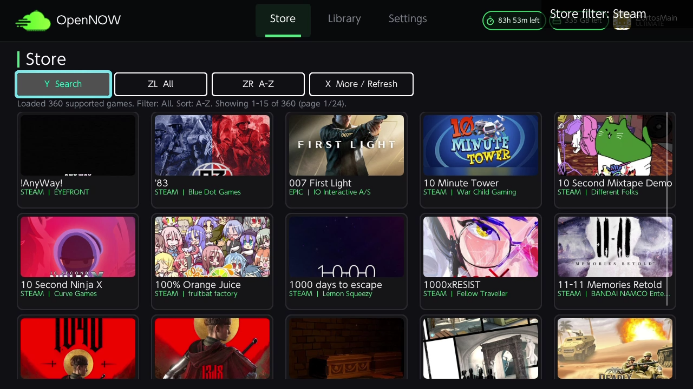
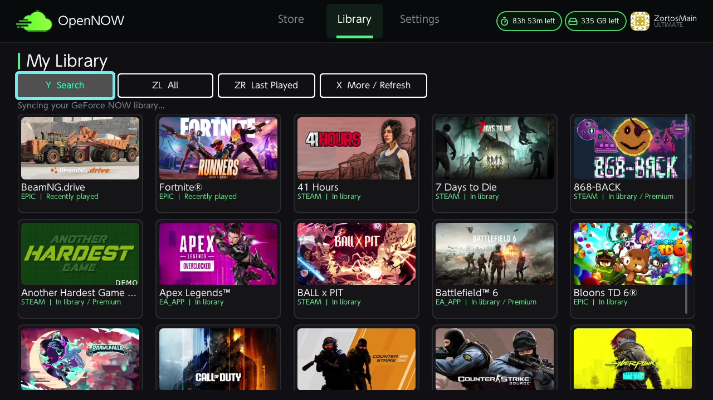
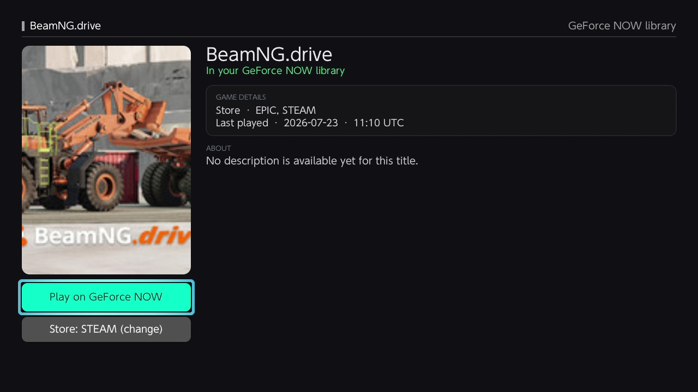
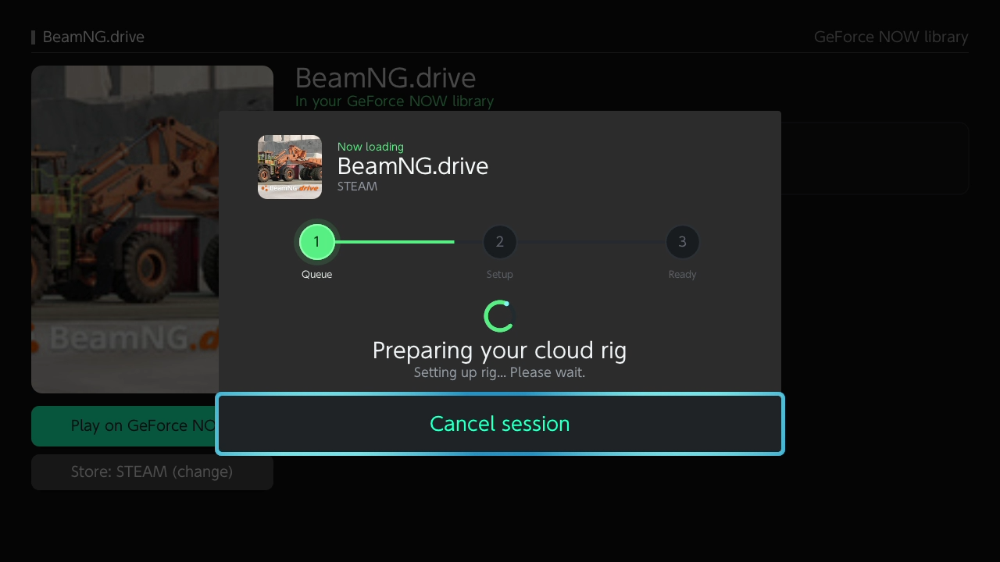

<h1 align="center">OpenNOW for Nintendo Switch</h1>

<p align="center">
  
</p>

<p align="center">
  <strong>A native, controller-first GeForce NOW client for Nintendo Switch homebrew.</strong>
</p>

<p align="center">
  Browse your library, launch a cloud session, and play through an open-source client built for the Switch.
</p>

<p align="center">
  <a href="https://github.com/OpenCloudGaming/OpenNOW-Switch/releases/latest">
    
  </a>
  <a href="https://opennow.zortos.me">
    
  </a>
  <a href="https://discord.gg/8EJYaJcNfD">
    
  </a>
</p>

<p align="center">
  <a href="https://github.com/OpenCloudGaming/OpenNOW-Switch/stargazers">
    
  </a>
  <a href="https://github.com/OpenCloudGaming/OpenNOW-Switch/releases">
    
  </a>
  
</p>

## See it in action

<table>
  <tr>
    <td width="50%">
      
      <br><sub><strong>Store</strong></sub>
    </td>
    <td width="50%">
      
      <br><sub><strong>Library</strong></sub>
    </td>
  </tr>
  <tr>
    <td width="50%">
      
      <br><sub><strong>Game details</strong></sub>
    </td>
    <td width="50%">
      
      <br><sub><strong>Session launch</strong></sub>
    </td>
  </tr>
</table>

> [!WARNING]
> OpenNOW for Nintendo Switch is under active development. Expect occasional
> bugs, rough edges, and platform-specific issues while the client matures.

> [!IMPORTANT]
> OpenNOW is an independent community project and is not affiliated with,
> endorsed by, or sponsored by NVIDIA or Nintendo. A valid GeForce NOW account
> and a modded Nintendo Switch with Homebrew Menu are required.

## Overview

OpenNOW is a native GeForce NOW client for Nintendo Switch homebrew. This
repository contains the Switch launcher, streaming runtime, HOME-screen
shortcut installer, host-side policy tests, and pinned build dependencies.

The client is designed around controller-first catalog browsing and native
WebRTC streaming with low-latency input, H.264 video, Opus audio, NVDEC hardware
decoding, and software-decoder fallback.

## Download

Grab the latest build from
[OpenNOW-Switch Releases](https://github.com/OpenCloudGaming/OpenNOW-Switch/releases/latest).

Install and setup guidance lives in the
[OpenNOW documentation](https://opennow.zortos.me). Nintendo Switch installation
requires custom firmware and Homebrew Menu.

> [!NOTE]
> The application currently retains the inherited `SwitchNOW.nro` filename and
> `sdmc:/switch/SwitchNOW/` data directory for compatibility. Renaming either
> requires a deliberate migration of accounts, settings, shortcuts, and
> recovery data.

## Build from source

The production target requires devkitPro, devkitA64, Switch portlibs, CMake,
Ninja, and the pinned dependencies under `extern/`.

From PowerShell with MSYS2 and devkitPro installed:

```powershell
.\build-switch.ps1
```

From a configured devkitPro MSYS2 shell:

```bash
bash scripts/build-switch-msys2.sh
```

The unified build produces:

```text
build/switch/SwitchNOW.nro
```

It includes NVDEC hardware decoding and the software-decoder fallback; there is
no separate NVDEC build flavor.

Create a release archive with:

```powershell
.\scripts\package-release.ps1 -Version 0.0.6
```

On Linux or in CI, use the equivalent shell entry point:

```bash
bash scripts/package-release.sh 0.0.6
```

Pushing a version tag such as `v0.0.6` runs the Blacksmith release workflow,
publishes both files to GitHub Releases, and generates notes from the changes
since the previous release. The tag must match the version in
`app/src/app_version.hpp` and `CMakeLists.txt`.

## Repository layout

```text
.
├── app/src/                 Launcher, GFN client, streaming, input, and UI
├── app/shortcut/            Per-game shortcut chainloader
├── resources/               RomFS fonts, translations, icons, and UI assets
├── extern/                  Pinned third-party dependencies
├── tests/                   Host-side policy and parsing tests
├── scripts/                 Supported build and packaging entry points
└── tools/
    └── opennow-forwarder-installer/
                             HOME-screen forwarder installer
```

## Development checks

Run the narrowest relevant host test first. A header-only test can be compiled
with:

```bash
g++ -std=c++20 -Wall -Wextra -Werror -Iapp/src tests/<name>.cpp
```

Tests that exercise implementation files must compile those `.cpp` files and
link their host dependencies. Host checks do not replace a devkitA64 Nintendo
Switch build.

## License

OpenNOW Switch is licensed under the [MIT License](LICENSE).

## Acknowledgements

This port is derived from
[SwitchNOW](https://github.com/Blade-Punisher/SwitchNOW) by
[Blade-Punisher](https://github.com/Blade-Punisher).

Core dependencies include
[Borealis](https://github.com/xfangfang/borealis),
[libpeer](https://github.com/sepfy/libpeer),
[FFmpeg](https://github.com/FFmpeg/FFmpeg),
[libnx](https://github.com/switchbrew/libnx),
[deko3d](https://github.com/devkitPro/deko3d),
[curl](https://github.com/curl/curl),
[Jansson](https://github.com/akheron/jansson), and
[zlib](https://github.com/madler/zlib).

Third-party license and attribution files remain alongside their vendored
components.
