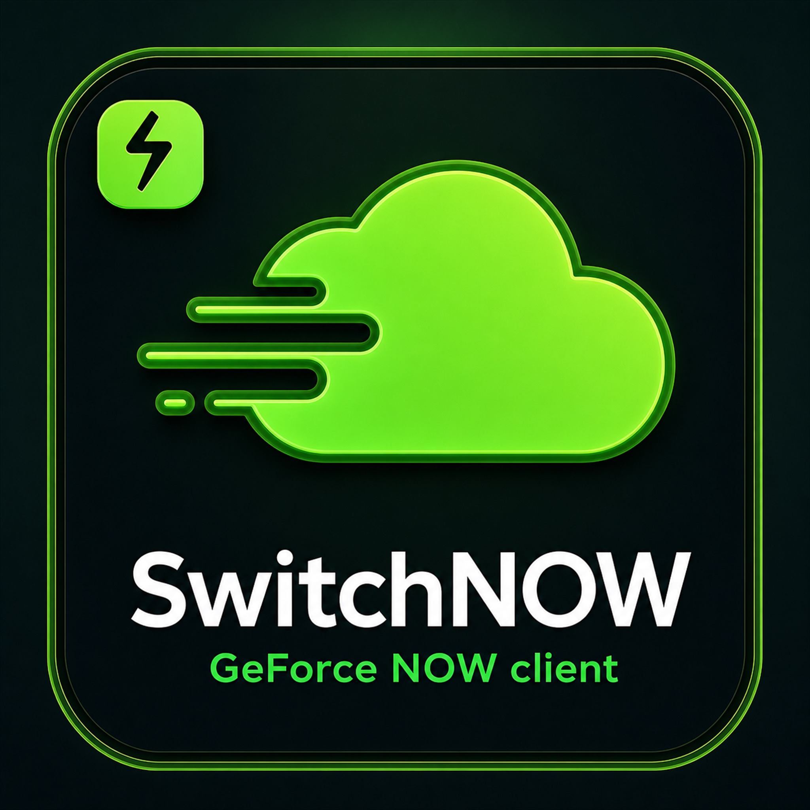
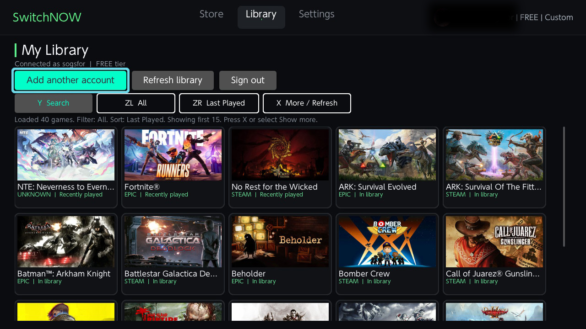
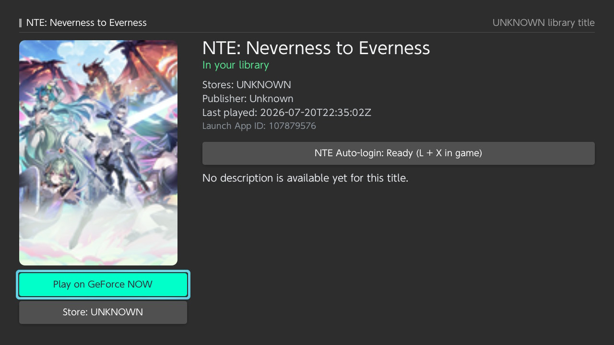
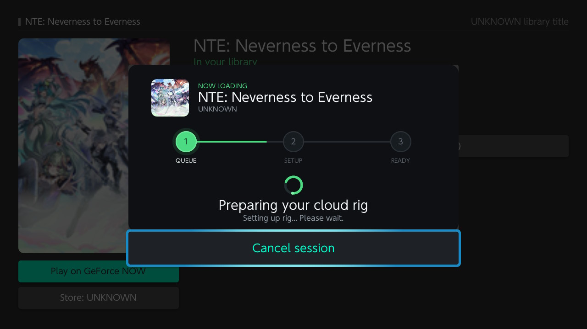

<p align="center">
  
</p>

# OpenNOW for Nintendo Switch

This repository is the Nintendo Switch foundation for
[OpenNOW](https://github.com/OpenCloudGaming/OpenNOW). It is forked from
[Blade-Punisher/SwitchNOW](https://github.com/Blade-Punisher/SwitchNOW), a native
Nintendo Switch homebrew client for GeForce NOW.

> [!WARNING]
> The OpenNOW integration is under active development. The current codebase still
> uses the inherited SwitchNOW name, assets, package paths and `.nro` filename.
> The documentation below describes that working baseline and will be updated as
> the OpenNOW implementation replaces it.

The inherited client combines a controller-first Borealis launcher with native
WebRTC signaling, H.264 video, Opus audio and low-latency input delivery.

> [!IMPORTANT]
> OpenNOW and SwitchNOW are independent community projects. They are not
> affiliated with, endorsed by or sponsored by NVIDIA or Nintendo. NVIDIA and
> GeForce NOW are trademarks of NVIDIA Corporation. A valid GeForce NOW account
> is required, and game availability, session duration and queues depend on the
> selected NVIDIA membership and region.

## Main features

- Browse the GeForce NOW catalog and the games linked to the current account.
- Cover-art cache, incremental catalog paging, search, filters and sorting.
- Per-game store selection for titles available through multiple storefronts.
- Persistent multi-account sign-in, token refresh and optional encrypted local
  password storage for quick sign-in and automatic account recovery.
- Animated queue, setup and connection stages while a cloud rig is prepared.
- Tegra X1 NVDEC hardware decoding with automatic software-decoder fallback.
- Bounded low-latency decode queues, damaged-frame suppression, RTCP recovery
  and keyframe resynchronization after packet loss.
- Synchronized Opus audio with configurable buffering and volume amplification.
- Xbox-compatible virtual gamepad, optional Switch-labelled face-button layout,
  touch-to-mouse input and an in-stream Nintendo keyboard.
- Adaptive stream-quality modes for motion resilience, clarity or untouched
  server output.
- Free-tier session warnings and automatic return to the game page after a
  session ends or the connection is lost.
- Opt-in flight-recorder diagnostics. Detailed logs and overlays are disabled
  by default during normal gameplay.
- Dedicated Neverness to Everness credential helper and guided in-game login.

## Technical specification

| Component | Implementation |
| --- | --- |
| Target platform | Nintendo Switch homebrew / Horizon OS |
| Package | Native `.nro` application |
| UI | Borealis, controller-first navigation, touch support |
| Signaling and media | Secure WebSocket signaling and WebRTC with ICE |
| Video codec | H.264 |
| Video decoder | Tegra X1 NVDEC, software FFmpeg fallback, automatic safe mode |
| Stream presets | Safe: 720p30 at 8 Mbps; Balanced: 720p60 at 12 Mbps; Quality: 1080p60 at 20 Mbps |
| Custom bitrate steps | 8, 12, 16, 20 or 25 Mbps |
| Quality modes | Adaptive, Clarity and Original |
| Audio | Opus, 30-100 ms configurable buffer, 8x-16x gain options |
| Input | Xbox-compatible gamepad reports, relative mouse and keyboard over the stream data channel |
| Interface languages | English, Simplified Chinese, Spanish, Russian, Italian, French, Polish and Ukrainian |
| In-game languages | 30 selectable locale profiles, sent when supported by the game |
| Local data | `sdmc:/switch/SwitchNOW/` |

### Video quality modes

- **Adaptive** is the recommended default. It balances minimum and initial
  bitrate, packet-loss resilience, light denoising and restrained sharpening.
- **Clarity** prioritizes a cleaner image and stronger detail recovery while
  retaining the same maximum bitrate selected in settings.
- **Original** disables the local image-enhancement pass and keeps the decoded
  server image as-is.

`Auto` selects NVDEC first and falls back to software decoding if hardware
initialization fails or the previous hardware session did not shut down cleanly.
The app avoids building an unlimited frame backlog: on congestion it drops stale
work, requests a clean reference frame and resumes from the newest valid image.

## Controls

### Launcher

| Input | Action |
| --- | --- |
| Left stick / D-pad | Move focus through buttons, settings and game tiles |
| `A` | Select or activate the focused item |
| `B` | Go back or close a dialog |
| `L` / `R` | Switch between Store, Library and Settings |
| `Y` | Open search in Store or Library |
| `ZL` / `ZR` / `X` | Context actions shown in the toolbar, such as filter, sort and load more |

Vertical game-grid movement keeps the closest column instead of returning to
the first tile in every row.

### In-stream gamepad

| Switch input | Xbox-compatible action sent to the game |
| --- | --- |
| `A`, `B`, `X`, `Y` | Xbox face buttons according to the selected layout |
| `L` / `R` | `LB` / `RB` |
| `ZL` / `ZR` | Full-value `LT` / `RT` |
| Left / right stick | Left / right analog stick |
| Stick clicks | `L3` / `R3` |
| D-pad | Xbox D-pad |
| `-` | View / Select |
| Short `+` press | Menu / Start |
| Hold `+` for at least 500 ms | Nexus / Guide |
| `ZL + ZR + -` | Safely stop streaming and return to the game page |

The default **Xbox** layout maps the physical Switch positions to Xbox labels:
`A -> B`, `B -> A`, `X -> Y`, `Y -> X`. Select **Switch** in
`Settings > Controls` to send matching letters instead.

### Keyboard, touch and NTE helper

| Input | Action |
| --- | --- |
| `- + Y` | Open the transparent in-stream keyboard |
| `A` | Select a key / confirm inside the keyboard |
| `+` | Submit the entered text and close the keyboard |
| `B` | Close the keyboard without submitting |
| Touch | Reposition the remote cursor to the touched point and perform a left click |
| Touch drag | Hold the left mouse button and move the remote cursor |
| `L + X` in NTE | Start the configured Neverness to Everness auto-login sequence |
| `B` during NTE auto-login | Cancel the sequence |

Game input is blocked while the keyboard or NTE login automation owns input, so
typing cannot accidentally trigger gameplay actions.

## Languages and settings

Select the launcher language in `Settings > Interface > Language` and press `X`
to save. The in-game language is configured separately in `Settings > Game`.
Supported games can also preserve graphics options changed inside a stream.

Existing installations are migrated automatically from
`sdmc:/switch/OpenNOWSwitch` to `sdmc:/switch/SwitchNOW` on first launch.

## Screenshots

### Library



### Game details



### Session launch



## Install

1. Copy `SwitchNOW.nro` and the icons to `sdmc:/switch/SwitchNOW/`.
2. Start Homebrew Menu in application mode by holding `R` while opening an
   installed game.
3. Launch SwitchNOW.

Application data, settings and optional debug logs are stored in
`sdmc:/switch/SwitchNOW/`.

## Build requirements

- Windows with MSYS2 at `C:\msys64`, or an equivalent Unix/MSYS2 shell.
- devkitPro with `devkitA64`, Switch portlibs and CMake/Ninja.
- The dependencies included in `extern/`.

Build from PowerShell:

```powershell
.\build-switch.ps1
```

Output:

```text
build/switch/SwitchNOW.nro
```

Create a conventional release archive:

```powershell
.\scripts\package-release.ps1 -Version 1.0.0
```

## Source layout

```text
app/src/                 Application, GFN API and streaming implementation
resources/               Fonts, icons and RomFS resources
extern/                  Pinned third-party dependencies
tests/                   Host-side policy and parsing tests
scripts/                 Switch build and release packaging
CMakeLists.txt            Switch build definition
build-switch.ps1          Windows build entry point
```

## Privacy

The repository contains no accounts, passwords, tokens, logs or device data.
Saved credentials are created only at runtime on the user's SD card. Password
storage is optional and uses the encrypted local credential vault.

## Support the upstream SwitchNOW project

The payment links below belong to the upstream SwitchNOW project and support its
original developer. They do not fund OpenNOW.

<a href="https://nowpayments.io/payment/?iid=5035597688&source=button" target="_blank" rel="noreferrer noopener"></a>

[Open the upstream SwitchNOW contribution page](https://nowpayments.io/payment/?iid=5035597688)

Contributions are entirely voluntary, are processed by the third-party
NOWPayments service, and do not unlock features or create any obligation or
warranty.

## Projects and acknowledgements

This fork is built on
[SwitchNOW](https://github.com/Blade-Punisher/SwitchNOW) by
[Blade-Punisher](https://github.com/Blade-Punisher). The original project's
architecture, implementation and documentation provide the working Nintendo
Switch baseline while OpenNOW integration is developed.

The inherited client also depends on the following open-source projects.
Reference projects inspired its architecture and user experience; they are not
copied into or linked directly with the SwitchNOW binary.

### Architecture and UX references

- [OpenNOW](https://github.com/OpenCloudGaming/OpenNOW) - GeForce NOW client,
  service flow and desktop UX reference.
- [OpenNOW-Switch](https://github.com/OpenCloudGaming/OpenNOW-Switch) - earlier
  Nintendo Switch research and implementation reference.
- [Moonlight-Switch](https://github.com/XITRIX/Moonlight-Switch) - Switch-native
  streaming, controller, rendering and hardware-decoding reference.

### Core build and runtime dependencies

- [devkitPro](https://devkitpro.org/),
  [libnx](https://github.com/switchbrew/libnx) and
  [deko3d](https://github.com/devkitPro/deko3d) - Nintendo Switch toolchain,
  platform services and graphics API.
- [Borealis](https://github.com/xfangfang/borealis) - console-oriented UI,
  navigation and rendering framework.
- [libpeer](https://github.com/sepfy/libpeer) - embedded WebRTC, ICE, DTLS,
  SRTP and data-channel foundation.
- [FFmpeg](https://github.com/FFmpeg/FFmpeg) and Averne's
  [NVTEGRA branch](https://github.com/averne/FFmpeg/tree/nvtegra) - H.264/Opus
  media processing and Tegra X1 hardware decoding support.
- [curl](https://github.com/curl/curl) - HTTPS and service requests.
- [Jansson](https://github.com/akheron/jansson) - JSON parsing and generation.
- [zlib](https://github.com/madler/zlib) - compression support.

### Bundled upstream components

The vendored Borealis and libpeer trees also contain components from
[GLFW](https://github.com/xfangfang/glfw),
[SDL](https://github.com/XITRIX/SDL),
[fmt](https://github.com/fmtlib/fmt),
[Tweeny](https://github.com/mobius3/tweeny),
[Yoga](https://github.com/facebook/yoga),
[NanoVG](https://github.com/memononen/nanovg),
[tinyxml2](https://github.com/leethomason/tinyxml2),
[libromfs](https://github.com/averne/libromfs),
[switch-libpulsar](https://github.com/p-sam/switch-libpulsar),
[libsrtp](https://github.com/cisco/libsrtp),
[usrsctp](https://github.com/sctplab/usrsctp),
[Mbed TLS](https://github.com/Mbed-TLS/mbedtls),
[cJSON](https://github.com/DaveGamble/cJSON),
[FreeRTOS coreHTTP](https://github.com/FreeRTOS/coreHTTP) and
[FreeRTOS coreMQTT](https://github.com/FreeRTOS/coreMQTT). Platform-specific and
optional components are selected by the build configuration.

Each upstream project remains subject to its own license and copyright notices.
This acknowledgement list does not replace the license files shipped with the
source and dependency trees.
